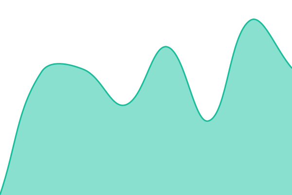

# [📈 Live Status](https://status.pi4li.com): <!--live status--> **🟧 Partial outage**

This repository contains the open-source uptime monitor and status page for [pi4li](https://status.pi4li.com), powered by [Upptime](https://github.com/upptime/upptime).

With [Upptime](https://upptime.js.org), you can get your own unlimited and free uptime monitor and status page, powered entirely by a GitHub repository. We use [Issues](https://github.com/pi4li/statuspage/issues) as incident reports, [Actions](https://github.com/pi4li/statuspage/actions) as uptime monitors, and [Pages](https://status.pi4li.com) for the status page.

<!--start: status pages-->
<!-- This summary is generated by Upptime (https://github.com/upptime/upptime) -->
<!-- Do not edit this manually, your changes will be overwritten -->
<!-- prettier-ignore -->
| URL | Status | History | Response Time | Uptime |
| --- | ------ | ------- | ------------- | ------ |
|  [PI4LI Website](https://pi4li.com) | 🟥 Down | [pi-4-li-website.yml](https://github.com/pi4li/statuspage/commits/HEAD/history/pi-4-li-website.yml) | 

 296ms
     
 | 

<a href="https://status.pi4li.com/history/pi-4-li-website">88.48%</a>
    

|  [Assets Server](https://assets.pi4li.com) | 🟩 Up | [assets-server.yml](https://github.com/pi4li/statuspage/commits/HEAD/history/assets-server.yml) | 

 314ms
     
 | 

<a href="https://status.pi4li.com/history/assets-server">0.00%</a>
    

|  [NatAndruStudy](https://natandrustudy.com) | 🟥 Down | [nat-andru-study.yml](https://github.com/pi4li/statuspage/commits/HEAD/history/nat-andru-study.yml) | 

 284ms
     
 | 

<a href="https://status.pi4li.com/history/nat-andru-study">88.48%</a>
    

|  [GymDays](https://gymdays.co.uk) | 🟥 Down | [gym-days.yml](https://github.com/pi4li/statuspage/commits/HEAD/history/gym-days.yml) | 

 334ms
     
 | 

<a href="https://status.pi4li.com/history/gym-days">88.48%</a>
    

|  [Where Have I Been?](https://wherehaveibeen.co.uk) | 🟥 Down | [where-have-i-been.yml](https://github.com/pi4li/statuspage/commits/HEAD/history/where-have-i-been.yml) | 

 306ms
     
 | 

<a href="https://status.pi4li.com/history/where-have-i-been">88.49%</a>
    

<!--end: status pages-->

[**Visit our status website →**](https://status.pi4li.com)

## 📄 License

- Powered by: [Upptime](https://github.com/upptime/upptime)
- Code: [MIT](./LICENSE) © [pi4li](https://status.pi4li.com)
- Data in the `./history` directory: [Open Database License](https://opendatacommons.org/licenses/odbl/1-0/)
